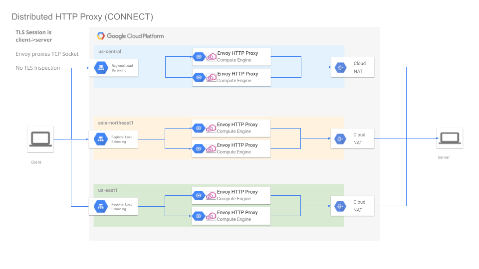
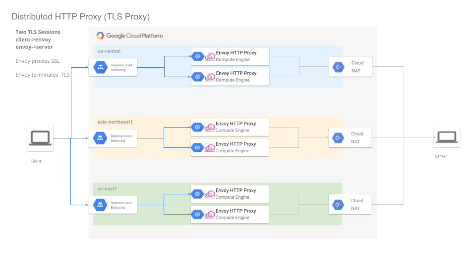
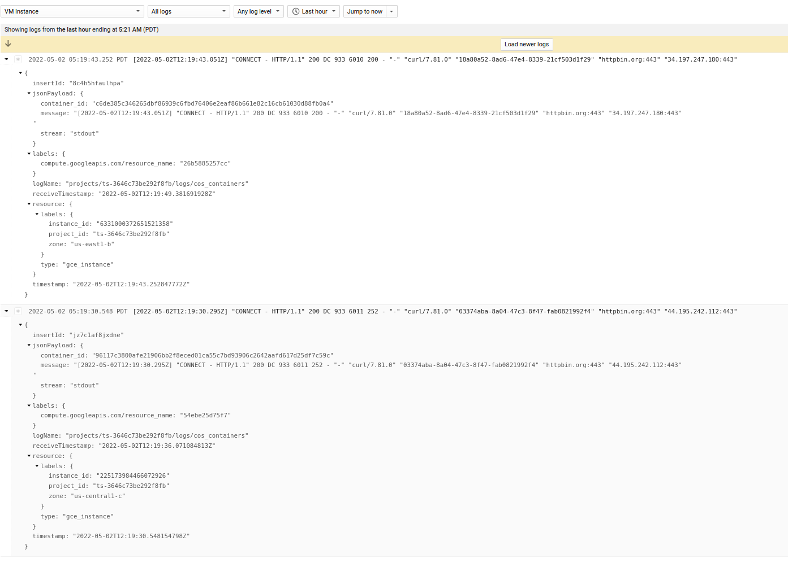
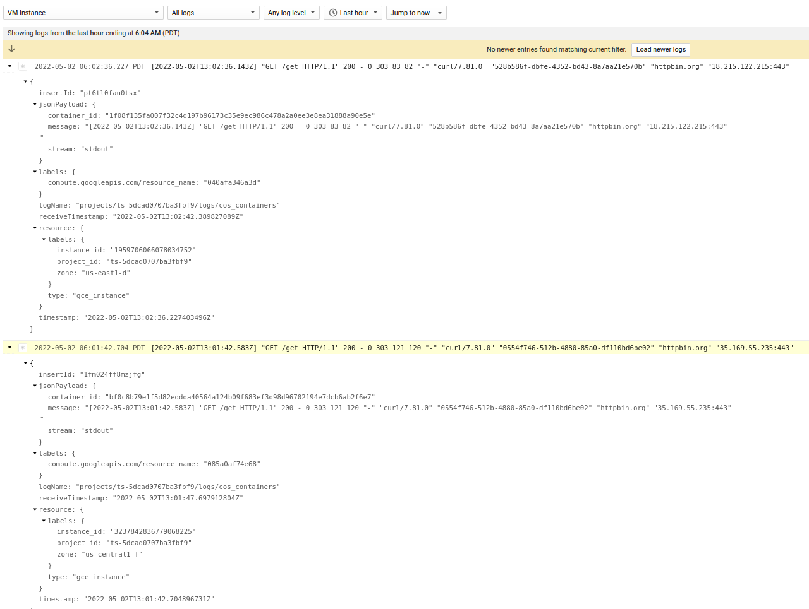
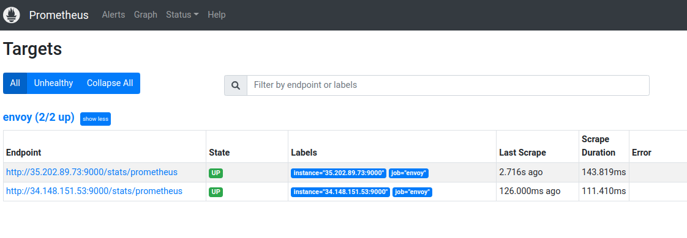
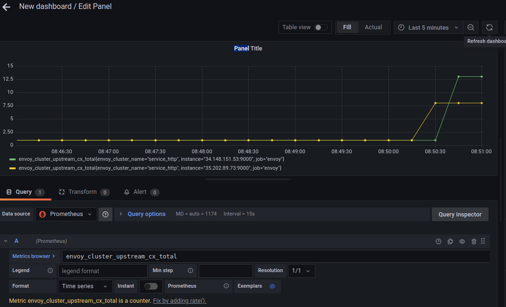
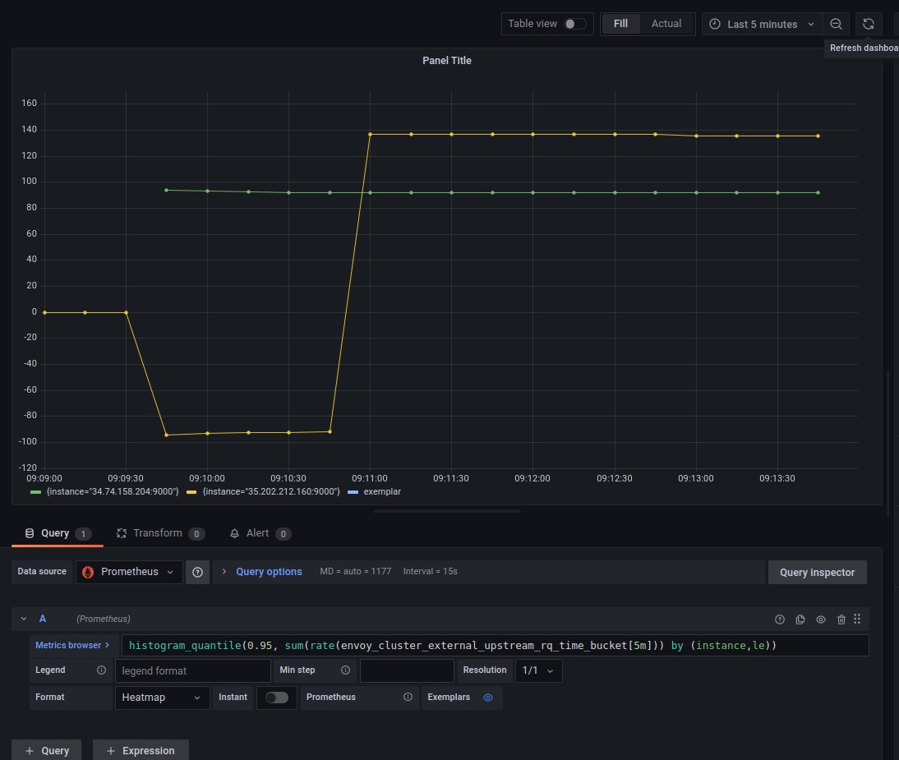

## Distributed HTTP Proxy on Google Cloud using Terraform 

Terraform module that allows you to easily create [HTTP CONNECT](https://developer.mozilla.org/en-US/docs/Web/HTTP/Methods/CONNECT) proxies in different Google Cloud Regions.

Once deployed, you can send traffic from your laptop through the usually by just setting the `http_proxy=` environment variable proxy. 

You can use this type of proxy to call the target service as if the request originated from a remote GCP datacenter.   

All traffic is sent `client->proxy->server`.

There are two modes of operation:

1. `HTTP Proxy`
  In this mode, the client connects to Envoy  using `HTTP Connect` mechanism and requests an upstream connection to the server.
  Envoy Proxy establishes a socket to the remote and proxies the TCP Traffic between the client and server.
  At no time can Envoy inspect the encrypted TLS traffic between the client and server

2. `TLS Proxy`
  In this mode, the client establishes a TLS connection to Envoy and Envoy then creates a *new* tls socket with the server.
  Envoy continues to inspect and proxy the TLS session.
  This mode does *not* use HTTP Connect and each client must trust the TLS certificate presented by Envoy.


### other references

- [Multi-mode Squid Proxy container running ssl-bump](https://blog.salrashid.dev/articles/2017/squid_proxy/)
- [Squid proxy cluster with ssl_bump on Google Cloud](https://blog.salrashid.dev/articles/2020/squid_ssl_bump_gcp/)
- [Monitoring GCP API Latency locally using Envoy](https://blog.salrashid.dev/articles/2022/envoy_gcp_monitoring/)
- [Envoy http/tcp Parser Plugin for Fluentd](https://blog.salrashid.dev/articles/2019/fluent-plugin-envoy-parser/)

- [Terraform examples for TCP proxy load balancers and SSL proxy load balancers](https://cloud.google.com/load-balancing/docs/tcp/ext-tcp-proxy-lb-tf-examples)
- [Terraform Provider for HTTP mTLS and POST Dataources](https://blog.salrashid.dev/articles/2021/terraform_post/)


>> this repo is NOT supported by Google Cloud Support

### Setup

These terraform scripts will:

1. Create a new GCP Project
2. Create a regional network loadbalancer in the regions you specify
3. Create an instance template which runs a Container Optimized VM without external IPs and deploys Envoy Proxy
4. Create a managed instance group as a backend service
5. Create a NAT Gateway to route traffic from the MIG


Since we're setting up a new GCP Project, you must of course have the ability to create a new project.

First _edit_ `variables.tf` and set

```hcl
# envoy will only proxy requests intended for this host
# all other requests will get rejected.  (todo: allow more hosts)
variable "allowed_host" {  
  type    = string
  default = "httpbin.org"   
}

# set this to the billing account you have access to 
variable "billing_account" {
  type    = string
  default = "000C16-9779B5-123456"
}

# set this to your
variable "org_id" {
  type    = string
  default = "673208781234"
}

# a list of regions where individual proxy instance groups will get created
# in the example below, a separate proxy cluster will get setup in 
# three different regions with three different regional load balancers
variable "regions" {
  type    = list(string)
  default = ["us-central1","us-east1"]
}

# this is the ip address rages that are allowed to invoke the proxy
variable "allowedIP" {
  type    = list(string)
  default = ["72.83.22.111/32"]
}
```

#### HTTP Proxy

As mentioned, to use this mechanism, you can usually set the `http_proxy=` environment variable.

```text
client -->
   Regional Network LoadBalancer
     --> AutoScaled Managed Instance Group 
        --> Container Optimized OS running Envoy
            --> Envoy creates TCP Tunnel to Server
                --> Server 
```




To deploy

```bash
cd proxy
terraform init
terraform apply
```

You will see output which shows the regions where the proxy is deployed and the cardinal loadbalancer IP addresses

```
Outputs:

allowedIP = tolist([
  "72.83.22.111/32",
])
lb_ip = [
  "35.202.89.73",
  "34.148.151.53",
]
project_id = "ts-3646c73be292f8fb"
project_number = "1090542778209"
regions = tolist([
  "us-central1",
  "us-east1",
])
```

Wait maybe 3 minutes for the LB programming to settle and propagate and then invoke the loadbalancer using the external IP

```bash
$ curl -s -x 35.202.89.73:3128 -L https://httpbin.org/get
{
  "args": {}, 
  "headers": {
    "Accept": "*/*", 
    "Host": "httpbin.org", 
    "User-Agent": "curl/7.81.0", 
    "X-Amzn-Trace-Id": "Root=1-626fcc52-545e32134476d2f06360e3e1"
  }, 
  "origin": "104.198.241.231", 
  "url": "https://httpbin.org/get"
}

$ curl -s -x34.148.151.53:3128 -L https://httpbin.org/get
{
  "args": {}, 
  "headers": {
    "Accept": "*/*", 
    "Host": "httpbin.org", 
    "User-Agent": "curl/7.81.0", 
    "X-Amzn-Trace-Id": "Root=1-626fcc5f-7d3286707fc9de854aa4f17e"
  }, 
  "origin": "34.138.250.151", 
  "url": "https://httpbin.org/get"
}
```

What the output shows is the JSON response from `httpbin.org/get` which just echos back the `origin` ip address it saw.  

In the examples above, those are the cloud NAT ip addresses:

```bash
$ gcloud compute routers list --project ts-3646c73be292f8fb
NAME                REGION       NETWORK
router-us-central1  us-central1  default
router-us-east1     us-east1     default


$ gcloud compute routers get-nat-mapping-info router-us-central1 --project ts-3646c73be292f8fb --region=us-central1
---
instanceName: vm-qtcv
interfaceNatMappings:
- natIpPortRanges:
  - 104.198.241.231:1024-1055

$ gcloud compute routers get-nat-mapping-info router-us-east1 --project ts-3646c73be292f8fb --region=us-east1
---
instanceName: vm-6klr
interfaceNatMappings:
- natIpPortRanges:
  - 34.138.250.151:1024-1055
```

If you want to proxy different hosts, you must edit the envoy configuration to allow those. 

TODO: allow dynamic config


### TLS Proxy

In this mode, you are not using `HTTP CONNECT` and instead Envoy acts as a normal `man in the middle` proxy with full traffic TLS decoding.

This ofcourse requires each client to trust the TLS CA that envoy runs and appropriate DNS/host resolution.  This mode should be very rare.




To deploy this, edit the `variables.tf` per the instructions above and then

```bash
cd tls/
terraform init
terraform apply
```

The output will show the Regional LB ranges allocated.  For example:

```
allowedIP = tolist([
  "72.83.22.111/32",
])
lb_ip = [
  "35.202.212.160",
  "34.74.158.204",
]
project_id = "ts-5dcad0707ba3fbf9"
project_number = "89351627456"
regions = tolist([
  "us-central1",
  "us-east1",
])
```

Now invoke the LB endpoint as if its the target service

```bash
$  curl -vvvvv   -H "Host: httpbin.org"   --resolve  httpbin.org:443:35.202.212.160  --cacert certs/tls-ca.crt   https://httpbin.org/get


< HTTP/1.1 200 OK
< date: Mon, 02 May 2022 13:01:42 GMT
< content-type: application/json
< content-length: 303
< server: envoy
< access-control-allow-origin: *
< access-control-allow-credentials: true
< x-envoy-upstream-service-time: 120
< 
{
  "args": {}, 
  "headers": {
    "Accept": "*/*", 
    "Host": "httpbin.org", 
    "User-Agent": "curl/7.81.0", 
    "X-Amzn-Trace-Id": "Root=1-626fd636-00e1547f0a64d0971e44ba48", 
    "X-Envoy-Expected-Rq-Timeout-Ms": "15000"
  }, 
  "origin": "35.239.54.238", 
  "url": "https://httpbin.org/get"
}
```

A couple of things to note:  

1. we rerouted host resolution for `httpbin.org` to the loadbalancer address
2. allowed curl to trust the CA certificate issued by a self-signed CA
3. `x-envoy-upstream-service-time`  is a default header returned by envoy which tell the client 'how long envoy took to get the full request-response stream from httpbin`.
  This is really useful since it shows you how much latency the services has from the region.

This repo uses a self-issued CA.  You can issue your own CA using [CA Scratchpad](https://github.com/salrashid123/ca_scratchpad).  Remember to set the various `SAN` values

### Observability

You can also do a small amount of monitoring on the proxy cluster you're running

#### Envoy Access Logs

Envoy runs with its [access logging](https://www.envoyproxy.io/docs/envoy/latest/configuration/observability/access_log/usage) enabled to stdout.

What that will show is the basic access logging for HTTP traffic like this:

For the http_proxy, you wont' ofcourse see much info at all other than the initial `CONNECT` request



Note, if you are using the TLS proxy, you will actually see the query string within the TLS request (in this case the path `/get`)



#### Prometheus and Grafana

Envoy also has a built in [Prometheus](https://prometheus.io/) endpoint which you can hook into to recieve [envoy cluster statistics](https://www.envoyproxy.io/docs/envoy/latest/configuration/upstream/cluster_manager/cluster_stats#general)

You an hook prometheus to `Grafana` to visualize the data.

If you just want to test, you can run prometheus and grafana locally in docker.  (this is just a demo...its not too feasible to do this locally)

The first step is to configure `prometheus`:

Edit `prometheus.yml` and set the endpoint targets to the public regional loadbalancer IP.  

Of course note that by connecting to the loadbalancer IP address you are only connecting to ONE envoy instance in the managed group...but this is my demo and its just a demo

In our case for the CONNECT, the lb IPs were  ("35.202.89.73","34.148.151.53"),

- `prometheus.yml`

```yaml
    static_configs:
    - targets: ['35.202.89.73:9000', '34.148.151.53:9000']
```

Now run a local prometheus instance

```bash
cd prometheus/
docker run \
    --net=host \
    -p 9090:9090 \
    -v `pwd`/prometheus.yml:/etc/prometheus/prometheus.yml \
    prom/prometheus
```

Verify the targets are running by going to [http://localhost:9090/targets](http://localhost:9090/targets)




Now run `Grafana` locally

```
docker run --net=host -p 3000:3000 grafana/grafana 
```

Access the Grafana screen locally at [http://localhost:3000](http://localhost:3000)  (the default is `admin/admin`)

Once there, configure it to use `Prometheus` as a source:

Select `Configuration -> Datasource`.  
Select `Prometheus`, set
the url to point to prometheus container: `http://localhost:9090/`
Click `save and test`.

Now create a dashboard, panel and use any statistic envoy publishes.  

In my case, i picked the upstream connection count: `upstream_cx_total`





You can see some details like histograms and response codes for the TLS proxy (since it knows about those)

eg, using `histogram_quantile(0.95, sum(rate(envoy_cluster_external_upstream_rq_time_bucket[5m])) by (instance,le))`.  For example, for the TLS Proxy (which would know the per-path and HTTP response codes)


